## Option 1: Real-Time Data Ingestion with Snowpipe
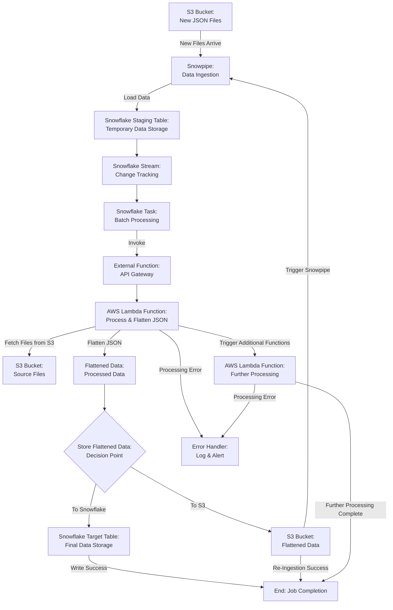

## Option 2: Enhanced AWS Glue Jobs
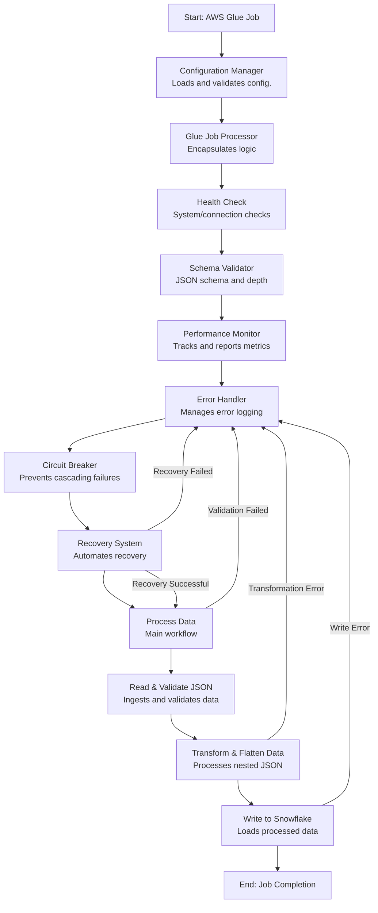

## Architecture Overview
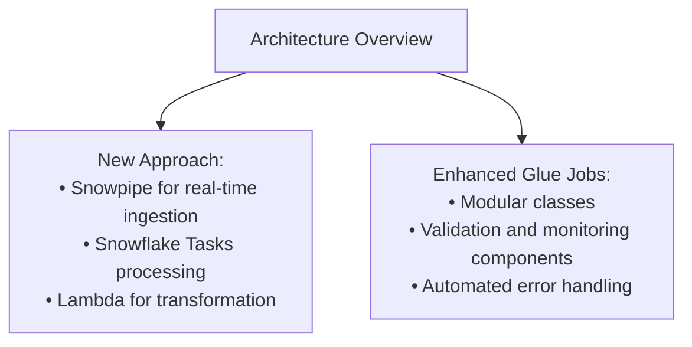

## Real-Time Processing
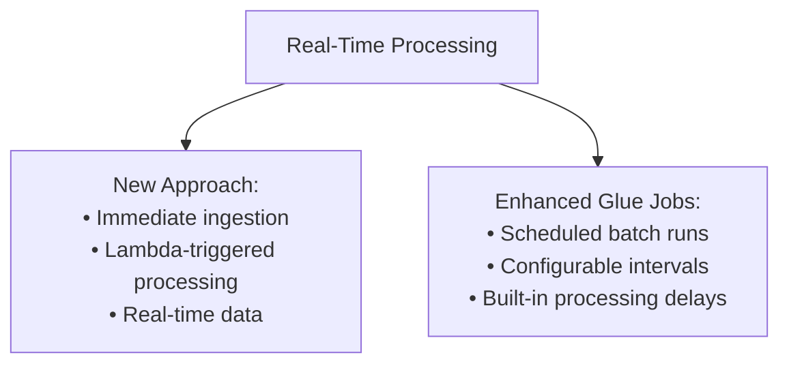

## Components
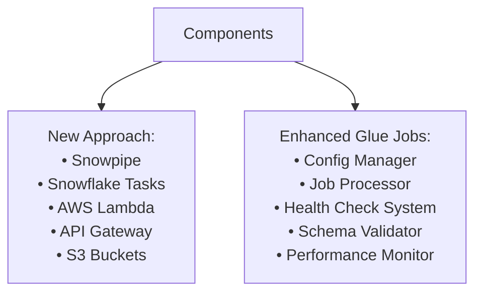

## Data Flow
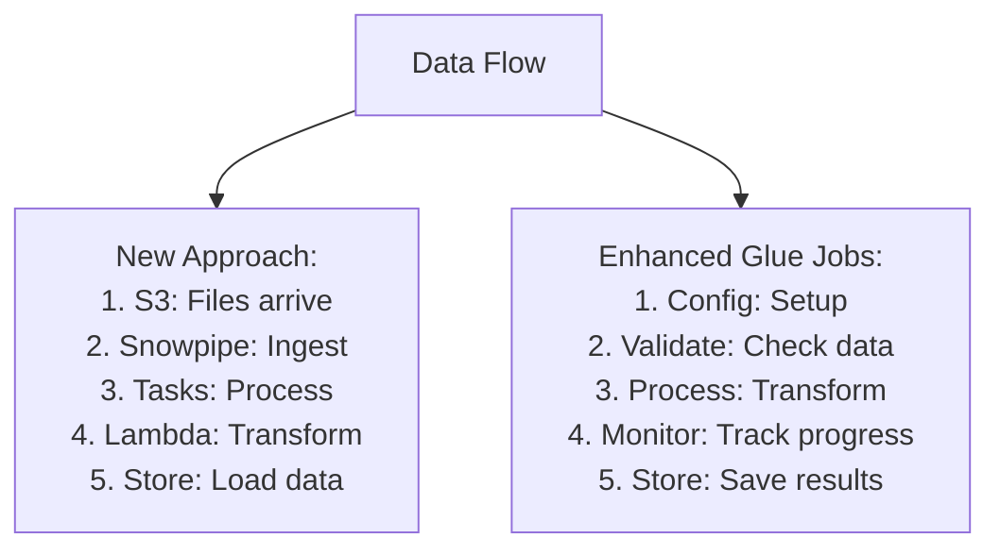

## Scalability
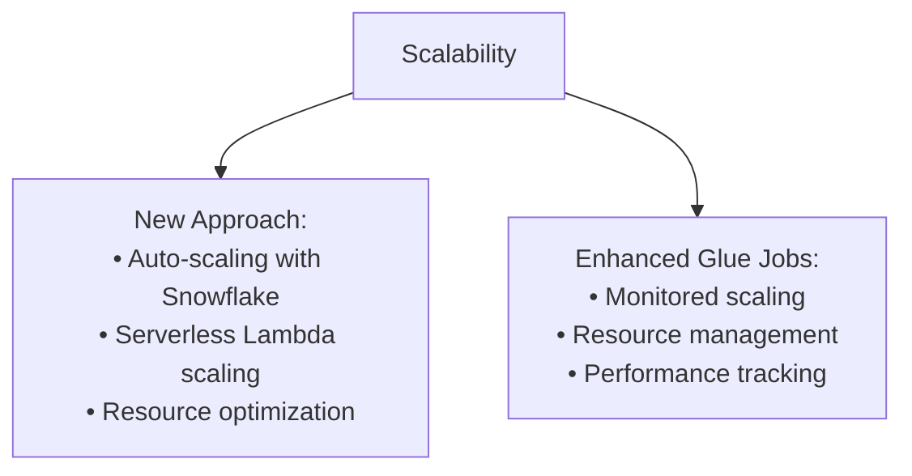

## Error Handling & Recovery
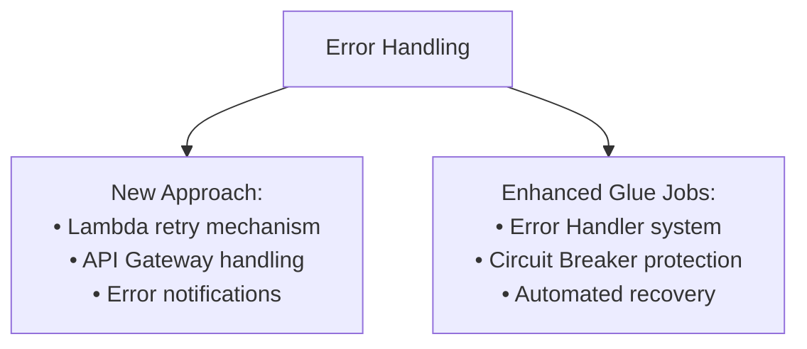

## Implementation Complexity
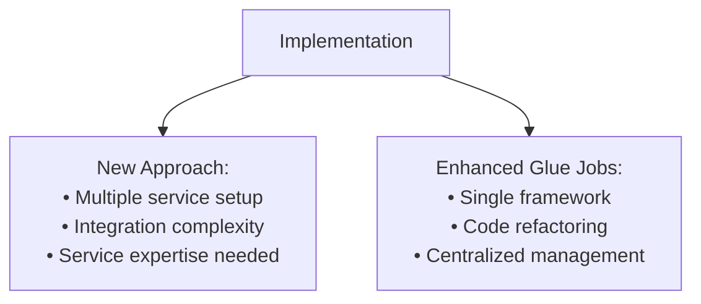

## Maintenance & Manageability
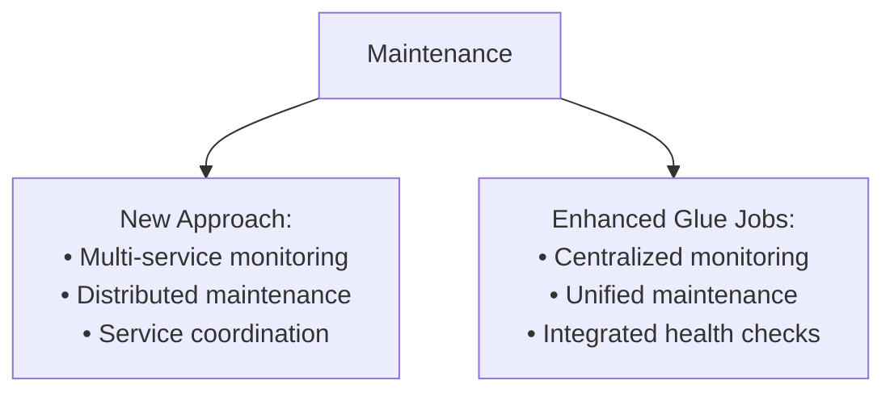

## Operational Overhead
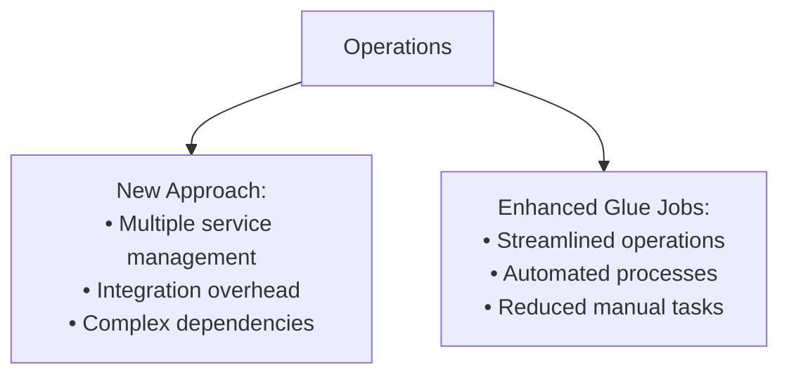

## Cost Implications
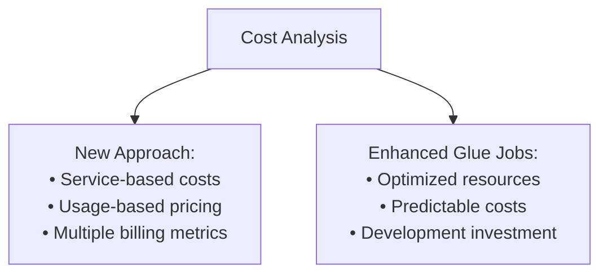

## Data Integrity & Validation
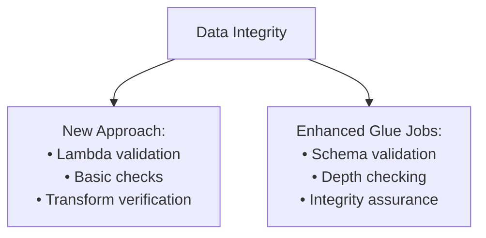

## Flexibility & Extensibility
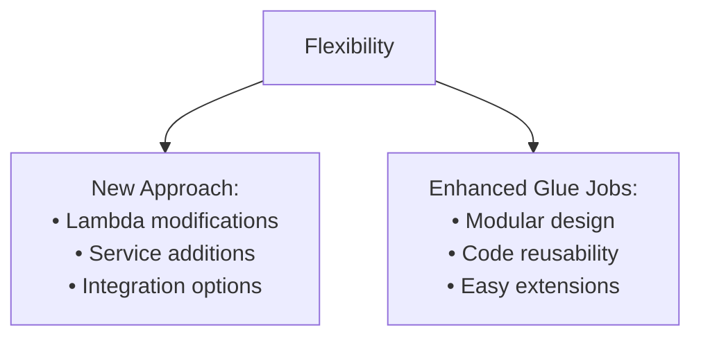

## Monitoring & Metrics
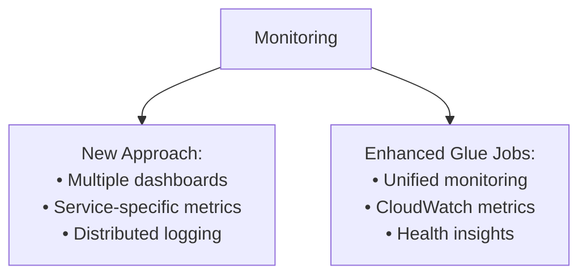

## Deployment & Configuration
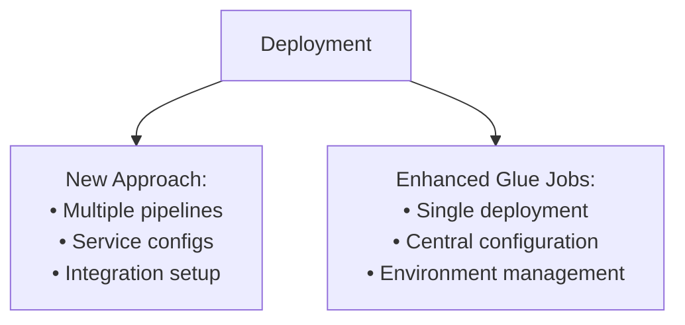

## Learning Curve
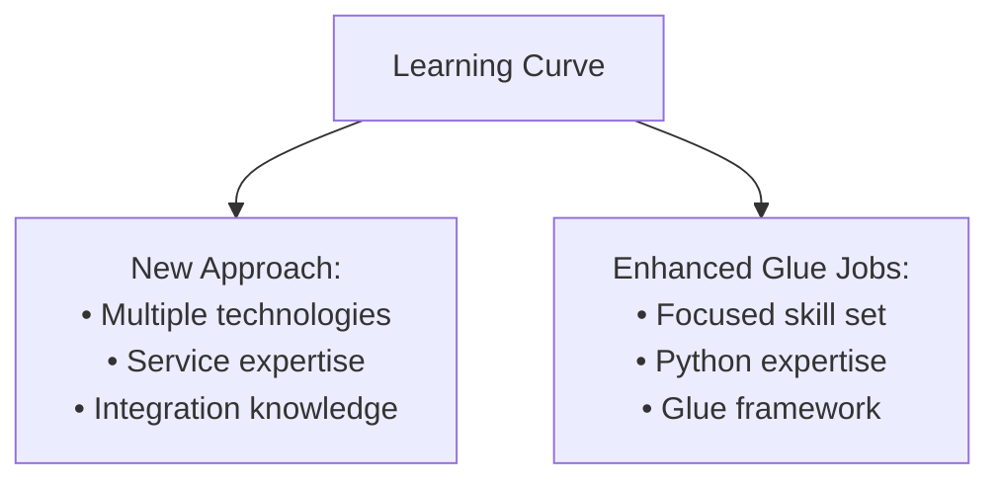
